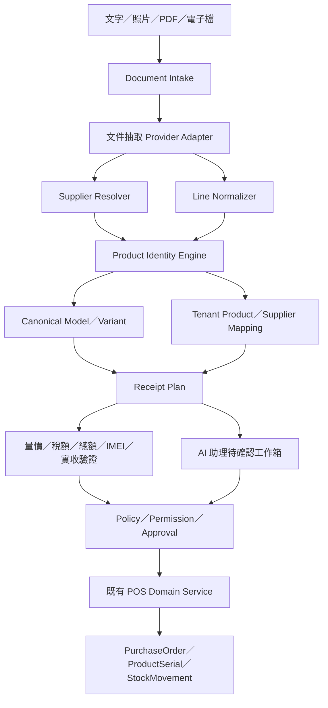

# MP POS AI 助理與智慧入庫架構修改實作計畫

> 文件日期：2026-07-11<br>
> 文件狀態：實作規劃 v1（以下「零、開工前固定契約」視為 P0 必守 ADR）<br>
> 適用專案：`MP_POS系統`<br>
> 修改邊界：本文件提出架構、資料模型、API、UI、遷移、測試與上線步驟；不在本文件中直接修改程式。

相關既有文件：

- [產品路線圖](product-roadmap.md)
- [AI 指令層](assistant-command-layer.md)
- [需求感知層](demand-signal-layer.md)
- [架構與程式碼地圖](architecture.md)
- [業務規則](business-rules.md)

## 快速閱讀

- 要先決定整體方向：看「一、執行摘要」與「二十二、最終決策摘要」。
- 要開始第一輪開發：直接看「十四、分期實作步驟」的 P0 與「十九、第一個實作迭代建議」。
- 要處理多供應商、多商家商品對應：看「五、商品身分設計」與「六、資料模型修改方案」。
- 要規劃上線與驗收：看「十五、資料遷移與切換策略」及「十六、測試與驗收」。

---

## 零、開工前固定契約

為避免實作時產生兩套提案、互相矛盾的狀態或可繞過的寫入路徑，本計畫先固定下列契約：

1. **Receipt Plan 就是擴充後的 `IntakeBatch`／`IntakeItem`，不另建第二套 ReceiptPlan 表。**「Receipt Plan」是業務名稱，資料仍落在 Intake app。
2. **上傳當下立即建立 `IntakeBatch + IntakeDocument + ExtractionJob`。**背景工作完成後填入同一批次，不等 OCR 完成才建 Batch。
3. **`IntakeBatch.workflow_status` 是唯一主要業務狀態。**抽取、驗證、核准各自使用 append-only Job／Run／Approval model，不再在 Batch 上放三組可能互相矛盾的 status。
4. **每次修改 header、line、商品映射、實收識別碼或重跑抽取都增加 `batch.version`，並使舊 Validation 與 Approval 失效。**
5. **P0 起所有 AI 進貨寫入必須改走 Intake，或先以 feature flag 停用現有 Assistant 直接建立 PurchaseOrder 的 confirm。**完整 `/assistant` UI 可留在 P2，但寫入旁路不能留到 P2 才處理。
6. **一般直接建立 PurchaseOrder 的 legacy API 保留給明確授權的管理／後備流程，並受相同 warehouse、role、audit 與 feature flag policy 控制。**不得成為規避 Intake 審批的公開捷徑。
7. **核准前不建立 active Product。**新品只保存 `LocalProductProposal`；commit 時在同一 transaction 內建立 Product、mapping、PurchaseOrder 與庫存。取消／拒絕不留下半成品商品。
8. **平台 canonical 只能由平台權限核准。**租戶遇到真正未知商品時，可在主管確認後建立 tenant-private Product 並保留 canonical proposal；不得因等待平台審核而阻斷必要入庫。
9. **實收以實體 unit 為單位，不以 IMEI 數量直接等同商品數量。** 一台裝置可以有零至多個 IMEI，仍只有一個實體 instance；Wi-Fi 平板可用 SN 作主要序號。
10. **P0 不默默改變現有成本與會計規則。**折扣、運費、外幣或帳本不支援的欄位可先抽取與核對，但必須標為例外並阻止 commit，直到另有 business-rule ADR 決定如何入帳。

---

## 一、執行摘要

整體方向可行，且目前系統不需要重寫。現有 Django／DRF 帳本、進貨 service、IMEI 驗證、庫存異動、加權平均成本、多租戶欄位、`ProductAlias`、`IntakeBatch`、`CommandLog` 與動態安全存量，已具備成為 AI POS 的重要底座。

真正要完成的產品不是「讓模型直接改庫存」，而是：

```text
自然語言／照片／PDF／電子檔
        ↓
文件抽取與意圖解析
        ↓
供應商識別＋共同商品身分解析
        ↓
量、價、稅、總額、實體 unit、必要識別碼與實際到貨規則驗證
        ↓
待確認提案／例外工作箱
        ↓
具權限的人員確認
        ↓
既有 POS service 原子過帳
```

本計畫的核心決策如下：

1. `catalog.Product` 繼續是每家商家的本地 SKU，不改寫既有進銷存帳本外鍵。
2. 新增平台級 `CanonicalModel` 與 `CanonicalVariant`，處理 N 家供應商與 N 家商家的共同商品身分。
3. 供應商講法、商家講法與共同商品分層保存，不把所有名稱塞在同一個欄位。
4. OCR、LLM、模糊搜尋只負責抽取與候選排序；正式寫入由規則、權限、審批與既有 service 決定。
5. 進貨單內容與「實際收到的貨」分開；序號商品逐台建立實體 unit，再依商品政策掃 primary serial／IMEI／SN 作到貨證據。
6. 先完成安全入庫，再做跨商家共同商品，再做助理主要介面，最後才讓搜尋熱度參與補貨。
7. 商家習慣主要透過別名、映射、偏好與確認紀錄學習，不需要每家商家各自重新訓練一個大型模型。

建議建置順序：

```text
P0 安全入庫閉環
  ↓
P1 平台共同商品身分
  ↓
P2 AI 助理主要介面
  ↓
P3 需求感知與補貨建議
  ↓
P4 跨商家匿名共學（長期）
```

---

## 二、目前完成程度與差距

| 能力 | 目前狀態 | 判定 |
|---|---|---|
| 進貨、IMEI、庫存、成本帳本 | 已有 service、原子交易與驗證 | 可直接沿用 |
| 單一商家面對多供應商別名 | 已有 `ProductAlias` | MVP 可用，需強化安全性 |
| 待確認入庫 | 已有批次、候選、人工對應、新品與過帳 | 垂直切片已成立 |
| 照片 OCR | 已有單一外部視覺模型串接 | 原型，未達正式環境要求 |
| PDF | 前端接受，後端仍當圖片送出 | 尚未真正支援 |
| 手機／平板拍照入庫 | OCR 沒有 IMEI，前端不能修正序號 | 目前無法完整過帳 |
| 供應商自動識別 | OCR 有讀名稱，但沒有拿來 resolve | 未完成 |
| 商品硬屬性檢查 | 目前主要只檢查容量 | 顏色、版本、狀態仍不足 |
| 自然語言助理 | 只有後端 `create_purchase_order` | 無主要 UI，功能不足 |
| 查庫存／條件報表指令 | intent 名稱預留但未實作 | 未完成 |
| 動態安全存量 | 已有 EWMA、14／90 日趨勢、生命週期 | 可作需求基線 |
| Google 搜尋熱度 | CSV 匯入與 DemandAlert 骨架 | 未串自動來源、未接 UI |
| 跨商家共同商品 | 所有 Product／Alias 都是 tenant-owned | 未完成 |

### 2.1 目前最值得保留的設計

- `commit_purchase_order()` 是正式帳本唯一入口之一，內含數量、序號、成本與庫存驗證。
- `IntakeBatch`／`IntakeItem` 已形成「先暫存、再確認」的安全邊界。
- `CommandLog` 已具備原始輸入、解析結果、提案、確認者與結果單據的稽核概念。
- `ProductSerial` 與 `StockMovement` 已能提供序號級庫存履歷。
- `TenantOwnedModel`、`for_tenant()` 與既有 `WarehouseScopedMixin` 可作多租戶／鎖倉安全底座。
- `velocity_ewma`、`trend_ratio`、`dynamic_safety_stock` 與 `lifecycle_status` 可作補貨基線。

### 2.2 目前最重要的阻斷點

1. OCR schema 沒有 `serial_numbers`，手機品項會在正式進貨驗證時被擋下。
2. OCR 後的數量、進價、條碼、料號與序號無法在 Intake UI 修正。
3. OCR 雖讀出 `supplier_name`，但沒有用來自動找供應商。
4. OCR 未抽取小計、稅、折扣、總額，無法進行單據平衡檢查。
5. `commit_batch()` 固定使用應稅內含，無法忠實反映不同進貨單稅別。
6. 低 OCR 信心只顯示提醒，不會阻止自動匹配或過帳。
7. `Product.capacity`、`color`、`region_version` 尚未完整出現在 serializer 與所有建檔路徑。
8. 目前 matcher 主要只檢查容量衝突，沒有完整檢查顏色、地區版本、狀態與包裝單位。
9. `verified` 尚未成為自動匹配必要條件；自動門檻設定沒有一致控制所有分支。
10. `Product.barcode` 沒有完整唯一性治理，同一條碼可能被多商品使用。
11. 錯誤別名修正沒有版本／撤銷流程，舊映射可能繼續存在。
12. Intake／Assistant API 尚未完整套用倉別權限與動作權限。
13. Intake 過帳缺少 idempotency 與批次 row lock，並發重送可能重複入庫。
14. OCR 同步佔用 HTTP worker，缺少背景工作、重試與狀態查詢。
15. Assistant 與 Identity 使用不同 resolver，白話指令可能繞過較安全的商品識別流程。

---

## 三、目標使用者體驗

### 3.1 一般使用者需要學習的介面

一般門市使用者原則上只需要熟悉：

1. 銷貨。
2. 查庫存。
3. 條件式銷售／毛利／庫存報表。
4. AI 助理的「待確認工作箱」。

商品主檔、別名、供應商映射、進貨表單、補貨參數等傳統頁面保留，但降級為：

- 管理員介面。
- 例外處理介面。
- AI 無法完成時的後備入口。

### 3.2 使用者拍攝進貨單後的理想流程

```text
拍照／上傳 PDF／匯入 Excel
        ↓
系統顯示「處理中」
        ↓
自動識別供應商、單號、日期、稅別、明細與總額
        ↓
逐行判定：既有商品／本店新品／真正未知／衝突
        ↓
序號商品逐台建實體 unit 並掃必要識別碼；配件確認實際數量
        ↓
顯示差異：短少、溢收、錯貨、成本差、低信心、重複單據
        ↓
使用者只處理紅色／黃色例外
        ↓
主管或具權限人員確認
        ↓
正式建立商品（必要時）＋建立進貨單＋入庫
```

### 3.3 不同風險採不同確認方式

| 情境 | 系統行為 |
|---|---|
| 已核准供應商料號、無屬性衝突、量價正常 | 綠色，自動帶入，仍需整批確認 |
| 已知共同商品，但本店尚無 SKU | 黃色，預填新商品提案 |
| 名稱相似但缺少容量／顏色／版本 | 黃色，要求選候選或補資料 |
| 條碼與文字屬性互相衝突 | 紅色，禁止自動匹配 |
| OCR 關鍵欄位信心過低 | 紅色，要求對照原圖修正 |
| 實體 unit 數與到貨數不符，或必要識別碼缺漏／重複 | 紅色，禁止過帳 |
| 供應商＋單號或檔案 hash 重複 | 紅色，禁止重複入庫 |
| 高總額、新供應商、新品或價格異常 | 要求主管核准 |

---

## 四、目標架構



### 4.1 各層責任

| 層 | 負責 | 不負責 |
|---|---|---|
| Document Intake | 收檔、hash、格式驗證、背景任務 | 不判定商品 |
| 文件抽取 | OCR、版面、表格、欄位信心、原文座標 | 不直接建立商品 |
| Supplier Resolver | 統編、名稱、帳號、版型識別 | 不依單一模糊名稱強制匹配 |
| Identity Engine | 共同商品、供應商映射、本地 Product 候選 | 不寫正式庫存 |
| Receipt Plan | 保存可編輯提案與差異 | 不等同正式進貨單 |
| Policy／Approval | 租戶、倉別、角色、金額與風險門檻 | 不重新計算帳本邏輯 |
| Domain Service | 最終驗證與原子過帳 | 不相信 AI 自評信心 |
| AI Assistant | 理解指令、組任務、解釋差異 | 不執行任意 SQL／HTTP／DB update |

---

## 五、N 家供應商 × N 家商家的商品身分設計

### 5.1 不採用 N×N 對照表

錯誤方向：

```text
供應商 A 品項 ↔ 商家 1 商品
供應商 A 品項 ↔ 商家 2 商品
供應商 B 品項 ↔ 商家 1 商品
供應商 B 品項 ↔ 商家 2 商品
```

這會讓映射隨供應商與商家數量相乘，無法維護。

正確方向：供應商與商家分別對到共同商品身分。

```text
供應商 A：IP15P-256-BK ─┐
供應商 B：蘋果15PRO黑256 ├─→ CanonicalVariant
                          │   Apple／iPhone 15 Pro／256GB／黑／台版
商家甲：15P黑256 ─────────┤
商家乙：蘋15P 256黑 ──────┘
```

### 5.2 共同商品的兩層粒度

#### CanonicalModel

代表產品型號層：

```text
Apple iPhone 15 Pro
Samsung Galaxy S25 Ultra
```

適合用於：

- Google Trends 關鍵字。
- 產品生命週期。
- 配件相容性。
- 維修需求。
- 跨容量／顏色的機型層分析。

#### CanonicalVariant

代表可銷售變體層：

```text
Apple iPhone 15 Pro／256GB／黑／台版
Apple iPhone 15 Pro／512GB／原色鈦／港版
```

適合用於：

- 進貨商品判定。
- 商家 SKU 對應。
- 供應商料號對應。
- 容量／顏色／版本衝突檢查。

### 5.3 新舊品項的三種判定

| Canonical | 本店 Product | 判定 | 行為 |
|---|---|---|---|
| 已存在 | 已連結 | 本店既有商品 | 直接帶入 |
| 已存在 | 未連結 | 對本店是新品 | 預填本地 Product 建檔提案 |
| 不存在 | 不存在 | 真正未知商品 | 建 provisional canonical＋人工確認 |

「無法識別」不得直接等同「新品」。

分期上需注意：P0 尚未建立完整平台 canonical，因此只能可靠區分「本店既有商品」與「本店未知／待建商品」；表中的三分法要到 P1 的 CanonicalModel、CanonicalVariant 與平台治理上線後才完整成立。P0 不得為了模擬平台已知商品而私建另一套 canonical 表。

### 5.4 建議比對順序

1. 真正的 GTIN／EAN／UPC 精準相符。
2. 已核准的 `tenant + supplier + supplier_sku`。
3. 已核准的商家舊 SKU／別名。
4. 原廠 MPN／型號碼＋品牌＋完整硬屬性。
5. 品牌、系列、世代、後綴、容量、顏色、地區版本與狀態解析。
6. 供應商歷史格式、文件版型、包裝單位與歷史成本輔助排序。
7. `pg_trgm`、embedding 或 LLM 只產生／排序候選。

### 5.5 硬性衝突規則

下列任一衝突均不得自動匹配：

- 容量不同。
- RAM／儲存組合不同。
- 顏色不同，且無已核准同義詞映射。
- 地區版本不同。
- 新品／拆封／中古等狀態不同。
- 單機與組合包不同。
- 包裝數或單位換算不同。
- 原廠 MPN 不同。
- 條碼指向 A，但其他高可信硬屬性明確指向 B。

完整 IMEI 識別單一實體設備；TAC 只能輔助機型，不足以單獨判斷容量、顏色或地區版本。

### 5.6 自動匹配必要條件

建議不要只用單一分數判斷，而採「必要條件＋分數」：

```text
唯一候選
AND 映射已核准 verified
AND 無任何硬屬性衝突
AND 關鍵 OCR 欄位達門檻
AND 前兩名候選差距達門檻
AND 該識別碼在作用域內唯一
AND 權限與風險政策允許
```

`98 分`只能代表規則分數，不代表真實世界有 98% 正確率。分數需透過實際單據回測校準。

### 5.7 學習與修正閉環

建議映射狀態：

```text
proposed → verified → superseded／revoked
```

規則：

1. AI 猜測只建立 `proposed`，不可直接取得自動過帳資格。
2. 人工選擇後先保存決策來源與操作者。
3. 成功過帳後，才可升為本租戶的 `verified`。
4. 修正錯誤映射時，停用舊版本並建立新版本，不覆蓋歷史。
5. 跨商家資料只能先產生平台候選，不直接讓另一家商店自動過帳。
6. 只有公開商品識別與匿名映射證據可跨租戶共享；價格、成本、庫存、銷量與私有名稱保持隔離。

---

## 六、資料模型修改方案

### 6.1 新增平台級商品模型

建議新增 app：`apps.product_identity`，避免把平台共同資料混入 tenant-owned 的 `apps.catalog`。

#### `CanonicalModel`

| 欄位 | 說明 |
|---|---|
| `id` | 平台識別碼 |
| `brand_code` | 標準品牌代碼 |
| `model_family` | 系列／型號族 |
| `generation` | 世代 |
| `model_suffix` | Pro／Ultra／Plus 等 |
| `product_type` | phone／tablet／watch／accessory 等 |
| `normalized_key` | 穩定唯一鍵 |
| `lifecycle_status` | 上市前／主力／換代／停產 |
| `release_date` | 上市日期，選填 |
| `status` | proposed／verified／retired |

建議唯一約束：

```text
(brand_code, normalized_key)
```

`CanonicalModel.lifecycle_status` 表示公開市場中的產品生命週期；本店是否停售、缺貨、清倉或暫停銷售仍由 tenant `Product` 與補貨政策決定，兩者不得互相覆寫。租戶只能提出平台資料候選，只有受控的 platform product steward／審核流程可以把 canonical、identifier、term alias 或 global offer 升為 `verified`。

#### `CanonicalVariant`

| 欄位 | 說明 |
|---|---|
| `model` | FK → CanonicalModel |
| `capacity` | 128GB／256GB／1TB |
| `ram` | 選填 |
| `color_code` | 標準顏色碼 |
| `region_version` | TW／HK／US／CN 等 |
| `normalized_key` | 變體唯一鍵 |
| `status` | proposed／verified／retired |

建議唯一約束：

```text
(model, capacity, ram, color_code, region_version)
```

`CanonicalVariant` 只描述硬體／可辨識變體。新品、拆封、中古、成色與本店銷售狀態留在本地 `Product.condition`／`ProductSerial`；箱、盒、組合包與 pack factor 留在 Supplier Offer／GTIN 包裝層級，避免同一硬體被拆成大量重複 canonical。

#### `CanonicalIdentifier`

| 欄位 | 說明 |
|---|---|
| `model` | nullable FK → CanonicalModel |
| `variant` | nullable FK → CanonicalVariant |
| `kind` | gtin／mpn／tac／oem_model |
| `value` | 原始識別碼 |
| `normalized_value` | 正規化值 |
| `original_symbology` | EAN-13／UPC-A／ITF-14 等原始碼制 |
| `package_level` | each／inner／case／pallet，僅 GTIN 使用 |
| `contained_gtin`／`pack_factor` | 箱裝與單品關係，選填 |
| `issuer` | GS1／OEM／GSMA／manual 等 |
| `verified` | 是否已核准 |
| `valid_from`／`valid_to` | 有效期間 |

`model` 與 `variant` 必須且只能指定其中一個。EAN／UPC 都以 `kind=gtin` 保存，正規化成 GTIN-14、驗證 check digit，並另留原始碼制。GTIN 通常指向 Variant 或特定包裝 trade item；TAC 只能指向 Model；MPN 依原廠實際粒度決定，唯一性至少需帶 manufacturer／issuer scope。TAC 不得當成唯一變體鍵。

#### `CanonicalTermAlias`

用於處理未知商品的結構化文字正規化，而不是直接建立商品映射：

| 欄位 | 說明 |
|---|---|
| `term_kind` | brand／model_suffix／capacity／color／region |
| `alias` | `BK`、`黑色`、`Black` 等原始講法 |
| `canonical_value` | `black` 等標準值 |
| `supplier_scope` | 選填；只有特定供應商使用時限定 |
| `tenant_scope` | 選填；商家私有習慣不升成平台規則 |
| `status` | proposed／verified／revoked |

`canonical_value` 必須引用受控代碼表，不保存任意自由文字；active 唯一鍵至少包含 `term_kind + normalized_alias + supplier_scope + tenant_scope + validity`。平台詞彙與租戶／供應商私有詞彙必須分層；別家出現一次的簡稱不可直接變成全平台硬規則。

### 6.2 以 `ProductCanonicalLink` 連結現有 `catalog.Product`

建議在 `apps.product_identity` 建一對一連結，而不是讓 Product 直接承擔核准與歷史狀態：

| 欄位 | 說明 |
|---|---|
| `tenant` | 必須等於 product.tenant |
| `product` | OneToOne FK → catalog.Product |
| `canonical_variant` | FK → CanonicalVariant |
| `status` | proposed／verified／superseded／revoked |
| `source` | import／manual／intake／platform_suggestion |
| `verified_by`／`verified_at` | 本店核准紀錄 |
| `valid_from`／`valid_to` | 重新映射時保留歷史 |

同一個 CanonicalVariant 可以被同一 tenant 的多個 Product 連結，例如全新、拆封與中古商品；從 canonical 反查本店 Product 時，必須再依 `Product.condition`、`is_secondhand`、active 狀態與業務類型選擇。找出多筆且無法唯一決定時必須進 review，不能 `.first()`。

保留所有現有欄位與外鍵，不修改下列帳本關係：

- `PurchaseOrderItem.product`
- `SalesOrderItem.product`
- `ProductSerial.product`
- `StockBalance.product`
- `StockMovement.product`

需要同步修正：

- `ProductSerializer` 加入 `capacity`、`color`、`region_version`，並以 read-only／受控欄位輸出目前的 `canonical_link`。
- 手機型號 wizard 建立 Product 時真正寫入 `capacity=cap`、`color=col`。
- 一般商品表單與批次建立路徑都能保存完整結構化屬性。
- 新品由 Intake 建立時，不得只寫品名與類別；應連結或建立 canonical 候選。

### 6.3 供應商身分與映射

#### `PlatformSupplier`

平台層只保存可公開驗證的供應商法律身分，例如統編、標準名稱與狀態；現有 `parties.Supplier` 新增 nullable `platform_supplier`，仍保留各商家的聯絡人、帳號、備註與交易條件。

| 欄位 | 說明 |
|---|---|
| `legal_name` | 標準法律名稱 |
| `tax_id` | 統編／稅籍識別，依地區與有效期間治理 |
| `country` | 國家／地區 |
| `status` | proposed／verified／retired |
| `verified_source` | 公開登記、人工或其他可信來源 |

#### `GlobalSupplierOffer`

只保存已確認為跨客戶穩定的供應商 SKU／公開品名到 CanonicalVariant 的映射，不包含價格、成本、採購量或商家帳號。它在其他租戶只能形成候選；不能直接取得自動過帳資格。

| 欄位 | 說明 |
|---|---|
| `platform_supplier` | FK → PlatformSupplier |
| `canonical_variant` | FK → CanonicalVariant |
| `unit`／`pack_factor` | 公開且穩定的包裝資訊 |
| `valid_from`／`valid_to` | 有效期間 |
| `status` | proposed／verified／superseded／revoked |
| `evidence_count` | 去識別化觀測數，只供平台審核 |

#### `GlobalSupplierOfferIdentifier`

一個 offer 可有多個 identifier／alias，避免把料號、品名、條碼塞在同一 row：

| 欄位 | 說明 |
|---|---|
| `offer` | FK → GlobalSupplierOffer |
| `kind` | supplier_sku／public_name／barcode／mpn |
| `value`／`normalized_value` | 原始值與正規化值 |
| `valid_from`／`valid_to` | 供應商改碼時使用 |
| `status` | proposed／verified／revoked |

#### `SupplierProductMap`

建議繼承 `TenantOwnedModel`，因為同一上游可能對不同客戶使用不同帳號或料號。

| 欄位 | 說明 |
|---|---|
| `tenant` | 商家 |
| `supplier` | 本店供應商 |
| `canonical_variant` | 共同商品 |
| `global_offer` | 選填；若能對到平台 offer |
| `customer_account_scope` | 供應商對本店的客戶帳號／通路範圍 |
| `unit`／`pack_factor` | 單位與換算 |
| `status` | proposed／verified／superseded／revoked |
| `confidence` | 校準後分數 |
| `source_intake_item` | 學習來源 |
| `verified_by`／`verified_at` | 核准資訊 |
| `valid_from`／`valid_to` | 本店映射有效期間 |

#### `SupplierProductMapAlias`

保存本店作用域內的一至多個 `supplier_sku`、`supplier_name`、`barcode` 或帳號專屬料號；active 唯一約束必須包含 tenant、supplier、customer account scope、kind、normalized value 與有效期間。

必要唯一約束至少包含：

```text
(tenant, supplier, canonical_variant, customer_account_scope, valid_to is null)
```

匹配優先序應為：本租戶 `SupplierProductMap` → 平台 `GlobalSupplierOffer` 候選 → 共同 identifier／屬性候選。本租戶已核准映射永遠優先於平台建議。

### 6.4 商家本地別名

#### `MerchantProductAlias`

| 欄位 | 說明 |
|---|---|
| `tenant` | 商家 |
| `product` | 本地 Product |
| `kind` | local_sku／legacy_name／nickname／search_term |
| `value` | 原始值 |
| `normalized_value` | 正規化值 |
| `status` | proposed／verified／revoked |
| `source` | manual／import／learned |

現有 `ProductAlias` 過渡期保留，採雙讀，不立即刪除。

### 6.5 映射決策紀錄

#### `ProductMatchDecision`

保存每一次自動或人工判定：

- 輸入原文與結構化屬性。
- OCR 各欄位信心。
- 候選及各項 evidence。
- 最終選擇。
- 決策方式：auto／human／import／platform_suggestion。
- 操作者、時間、來源單據。
- 是否後續被修正。

`ProductMatchDecision` 必須繼承 `TenantOwnedModel`，因輸入原文、供應商單據、候選、信心、成本與操作者都可能含租戶私有資料；不得把整筆 decision 發佈成平台公共資料。跨租戶只可另產生經去識別、達最小樣本門檻的聚合 evidence。

這張表是回歸測試集、信心校準與錯誤追查的重要資料，不應只存在 log 文字。

### 6.6 擴充 Intake 模型

#### `IntakeBatch` 建議新增

- `workflow_status`
- `version`
- `plan_hash`
- `supplier_raw_name`
- `supplier_tax_id`
- `supplier_risk_score`
- `supplier_doc_date`
- `receiving_date`
- `tax_method`
- `invoice_form`
- `invoice_no`
- `invoice_date`
- `payment_method`
- `purchase_category`
- `subtotal`
- `tax_amount`
- `discount_total`
- `shipping_total`
- `document_total`
- `calculated_total`
- `currency`
- `committed_purchase_order`：OneToOne FK → PurchaseOrder，取代無 FK 約束的 BigInteger

`document_hash` 屬於 `IntakeDocument`，因同一批次可能有多個檔案；idempotency 屬於獨立紀錄，不放在 Batch。

#### `IntakeDocument`

- `content_hash`
- `mime_type`
- `page_count`
- `document_role`：invoice／packing_list／serial_list／other
- `storage_key`
- `original_filename`
- `is_password_protected`
- `uploaded_by`

相同 hash 可重新上傳以恢復失敗／已取消流程，但同一有效供應商單據不得再次 commit；API 應回既有批次或明確重複警告，而不是只做 application-level exists 查詢。

#### `ExtractionJob`

- `batch`／`document`
- `status`：queued／running／succeeded／failed／dead
- `provider`／`model_version`／`schema_version`
- `attempt`／`max_attempts`
- `lease_until`／`heartbeat_at`
- `started_at`／`finished_at`
- `error_kind`／`error_message`
- `cost_meta`

Provider 呼叫不包在長時間 DB transaction 內。

#### `IntakeValidationRun`

保存 `batch_version`、`plan_hash`、所有 error／warning／evidence 與執行版本。只有針對目前 version 且無 blocking error 的 validation 才有效。

#### `IntakeApproval`

append-only 保存：

- `batch_version`／`plan_hash`
- approver、role、tenant、warehouse
- decision：approved／rejected
- reason
- expires_at

任何 edit、scan、re-extract 或 mapping 修正都使舊 approval 失效。低風險批次可由 policy 明確標記 `approval_not_required`，不是偽造一筆主管核准。

#### `IdempotencyRecord`

| 欄位 | 說明 |
|---|---|
| `tenant`／`operation`／`key` | active 唯一鍵 |
| `request_hash` | 同 key 不同 request 時回 409 |
| `status` | in_progress／succeeded／failed |
| `response_reference` | 既有 PurchaseOrder／Batch |
| `expires_at` | 保留期限 |

#### `IntakeItem` 建議保留 raw 與 corrected 兩組值

不要覆蓋 OCR 原始值：

```text
raw_name            corrected_name
raw_qty             corrected_qty
raw_unit_price      corrected_unit_price
raw_barcode         corrected_barcode
raw_vendor_sku      corrected_vendor_sku
```

另新增：

- `canonical_variant`
- `matched_product`
- `proposed_product_data`：只保存 LocalProductProposal，不立即建 active Product
- `document_qty`
- `billed_qty`
- `free_qty`
- `received_qty`
- `unit`
- `pack_factor`
- `line_amount`
- `requires_manager_approval`
- `match_evidence`
- `reviewed_at`

數量語意固定如下：

```text
document_qty = 供應商文件宣稱出貨數
billed_qty   = 供應商實際計價數（贈品不計價）
received_qty = 門市實際收到的實體件數
```

現有 `PurchaseOrderItem.qty` 必須映射 `received_qty`；`billed_qty` 映射同名欄位。若 `document_qty`、`billed_qty`、`received_qty` 不一致，先產短少／溢收／贈品例外，依租戶政策決定是否阻止過帳；不得靜默改成 1 或 0。

#### `IntakeReceivedUnit`

序號商品每一個實體 instance 一筆：

- `tenant`／`batch`／`item`
- `unit_index`
- `status`：captured／verified／released／committed
- `source`：document／physical_scan／manual
- `captured_by`／`captured_at`

#### `IntakeUnitIdentifier`

一個實體 instance 可有零至多個識別碼：

- `unit`
- `kind`：primary_serial／imei／imei2／eid／sn
- `raw_value`／`normalized_value`
- `is_primary`
- `source`
- `status`／`superseded_by`

對 active physical identifier 建 tenant-scope DB unique constraint；刪除／更正使用 record ID，不把完整 IMEI 放在 URL 或 access log。IMEI 可驗證 15 位與 check digit，但 `received_qty` 應等於實體 unit 數，而不是所有 IMEI row 數。

若正式庫存需要保存 IMEI1、IMEI2、EID 與 SN，另新增 `ProductSerialIdentifier`；現有 `ProductSerial.serial_no` 保存依商品政策選出的 primary serial。商品／產品類型需定義 identifier policy，不能假設所有裝置只有一個 IMEI。

### 6.7 建議批次狀態機

```text
uploaded
  ├─→ extraction_failed ──重試──┐
  ↓                             │
needs_review ◄──────────────────┘
  ↓
ready_for_receiving
  ↓
receiving
  ↓
validated
  ├─高風險→ pending_approval ─拒絕→ rejected
  │                    └核准→ ready_to_commit
  └─低風險／不需主管核准──────→ ready_to_commit
                                      ↓
                                  committing
                              ┌───────┴────────┐
                              ↓                ↓
                         commit_failed      committed

任何未結案狀態 ──使用者取消→ cancelled
```

狀態轉移應由 service 控制，不允許前端任意 PATCH status。`rejected` 表示具權限者明確否決某一 version，可建立新 version 後回 `needs_review`；`cancelled` 表示整批終止。`commit_failed` 修正資料後增加 version 並回到 `needs_review`／`ready_for_receiving`，不能直接重用舊核准。

---

## 七、現有 Identity Engine 的修改

### 7.1 先修資料完整性

修改位置：

- `backend/apps/catalog/models.py`
- `backend/apps/catalog/serializers.py`
- `backend/apps/catalog/services_model_bundle.py`
- 所有可新增／修改 Product 的前端表單與批次建立流程

步驟：

1. 補齊 serializer 欄位。
2. 修正手機 wizard 寫入容量、顏色與地區版本。
3. 回填既有 Product：先從結構欄位，再從 spec／name 解析候選。
4. 無法確定者只產報表，不自動回填。
5. 新增資料品質頁，列出缺容量、缺顏色、缺版本、重複條碼與可疑重複商品。

### 7.2 重寫匹配 evidence，而不是只回單一分數

建議 matcher 回傳：

```json
{
  "decision": "auto_match | review | unknown | conflict",
  "candidate_id": 123,
  "score": 99,
  "evidence": [
    {"kind": "supplier_sku_exact", "weight": 50},
    {"kind": "capacity_equal", "weight": 15},
    {"kind": "color_equal", "weight": 10}
  ],
  "conflicts": [],
  "runner_up_gap": 22
}
```

任何 conflict 優先於 score。

### 7.3 條碼治理

1. 區分真正 GTIN 與商家／供應商內部條碼。
2. 真正 GTIN 放 `CanonicalIdentifier` 並具平台唯一性。
3. 商家內部條碼需 tenant scope。
4. 如果同一識別碼出現多個指向，不得 `.first()` 自動選擇，必須標記資料衝突。

### 7.4 verified 與門檻

- 自動匹配只接受 `verified=True` 且 active 的映射。
- `IDENTITY_AUTO_MATCH_SCORE` 必須真正作用於所有分支。
- 已學別名 97 分不得繞過設定的 98 分門檻。
- OCR 關鍵欄位信心低時，即使字串精準也只能進 review。
- 門檻由資料回測決定，不應只靠人工設定。

### 7.5 修正別名流程

目前的 `get_or_create()` 不足以處理錯誤映射修正。改為：

1. 讀取現有 active mapping。
2. 指向相同商品時增加觀測次數與最後確認時間。
3. 指向不同商品時，建立 conflict 並要求主管確認。
4. 核准新指向後，將舊 mapping 標為 superseded。
5. 保留完整歷史，支援回滾。

---

## 八、OCR／PDF／電子檔修改

### 8.1 Provider Adapter

將目前單一 provider request 拆成介面：

```python
class DocumentExtractor:
    def extract(self, file, context) -> ExtractedDocument:
        ...
```

實作可包括：

- 多模態模型。
- 專用 invoice parser。
- 原生 PDF table／text extractor。
- Excel／CSV parser。
- 供應商固定格式 parser。

上層只依賴統一 schema，不依賴特定模型名稱或 HTTP 格式。

### 8.2 輸入分類

| 輸入 | 優先處理 |
|---|---|
| Excel／CSV | 直接讀結構資料，不做 OCR |
| PDF | 逐頁檢查 text layer 品質；原生頁先抽表格，掃描／壞文字層頁再 render OCR |
| 手機照片 | 旋轉、裁切、去透視、品質檢查後 OCR |
| 多頁文件 | 每頁保留 page number 與座標 |

另需明定 password-protected PDF、最大檔案大小、最大頁數、解析 timeout、壓縮炸彈，以及 Excel macro／external link 的隔離政策。

### 8.3 統一抽取 schema

單頭至少包含：

```text
supplier_name
supplier_tax_id
supplier_account_no
doc_no
supplier_doc_date
currency
tax_method
invoice_form
invoice_no
invoice_date
payment_method_hint
purchase_category_hint
subtotal
tax_amount
discount_total
shipping_total
total
```

明細至少包含：

```text
raw_name
supplier_sku
manufacturer_part_no
barcode
qty
billed_qty
free_qty
unit
pack_factor
unit_cost
line_amount
document_identifiers
provider_confidence
page_no
bounding_box
```

不同 provider 的 confidence 與座標不可直接比較，也不能要求多模態 LLM 自行編造可信座標。每次 extraction 必須另存：

```text
provider
model_version
schema_version
provider_confidence（nullable）
calibrated_risk_score
calibration_version
validation_evidence
```

若 provider 沒有可校準 confidence，預設 fail closed 進人工 review。自動門檻需依 provider、版本、欄位與供應商／版型，在獨立 holdout dataset 校準。

### 8.4 繁中 Provider 能力矩陣

| 方案 | 適合 | 限制／使用原則 |
|---|---|---|
| Azure prebuilt invoice | 官方列出繁中台灣、TWD、照片／PDF與 line items，可作第一個 PoC | 仍需用本店真實單據驗證；IMEI 等通訊業欄位可能需自訂抽取 |
| Google Enterprise OCR | 中文文字與版面 OCR | 預訓練 Invoice Parser 官方語言清單不含中文；需 custom extractor／規則補強 |
| 多模態 LLM | 版型變動、欄位正規化、低頻例外 | 不保證可信 confidence、bounding box 或序號精準度，不作量價唯一權威 |
| 供應商固定 parser | 高量、固定 Excel／PDF／CSV | 維護成本較高，但可提供最穩定的量價與料號精準度 |

### 8.5 文件驗證

必做規則：

- `qty × unit_cost` 與 line amount 容差檢查。
- 明細合計、折扣、運費、稅與總額平衡。
- 供應商＋單號不可重複。
- 檔案 hash 不可重複入庫。
- 單位與 pack factor 合理。
- 序號商品的 `received_qty` 等於實體 unit 數；每個 unit 依 identifier policy 具備必要的 primary serial／IMEI／SN。
- 相同 IMEI 不可在文件內或系統內重複。
- 低信心關鍵欄位必須人工覆核。

低原始 confidence 阻止的是「未覆核資料送審／commit」。使用者對照原圖修正並確認後，以 corrected value 與人工 evidence 重新驗證，不應永遠因原始 OCR 低分被擋。

### 8.6 OCR 與實物到貨分離

OCR 得到的是「供應商聲稱出貨」，不是「門市實際收到」。

手機／平板：

- 逐台建立實體 unit，再掃描商品政策要求的 primary serial／IMEI／SN；雙 SIM／eSIM 可保存多個 identifier。
- 可先用單據印刷序號預填，但實物掃描覆核才算 received。
- 顯示短少、溢收、錯序號、重複序號。

配件：

- 使用者確認實收數量。
- 若未來導入條碼盤點，可用批量掃描累加。

### 8.7 背景工作

OCR 不應同步卡住 API worker。建議流程：

```text
POST upload → 立即建立 Batch／Document／Job
            → 202 {batch_id, document_id, job_id, workflow_status}
GET job/{id} → queued／running／succeeded／failed／dead
succeeded → 填入同一 IntakeBatch 並推進 workflow_status
```

必要能力：

- timeout。
- retry with backoff。
- provider error classification。
- request cost／token／page count 紀錄。
- 同一文件避免重複送出。
- 失敗後可換 provider 重跑。

現有單機 Mac mini 建議 P0 先採 PostgreSQL-backed job queue＋獨立 Django management worker，避免立即引入 Redis／Celery；需有 lease、heartbeat、dead-letter、獨立 launchd plist、health check 與 graceful deploy。若未來規模需要，再換成專用 queue，Extractor service contract 不變。

### 8.8 檔案安全

- 檔案型別與大小白名單。
- 病毒／惡意檔案掃描。
- 原圖下載需 tenant permission，不直接公開 media URL。
- 正式環境採受保護物件儲存或權限下載 endpoint。
- 原圖納入備份與保留期限政策。
- 對外 OCR 前記錄 provider、資料處理政策與租戶同意設定。
- 文件內容視為不可信輸入，不允許其文字改變工具權限或執行規則。
- 文件抽取使用「無工具」的 extract-only context。
- raw OCR／PDF 文字不得直接進入具寫入工具的 agent context；節點間只傳嚴格 schema 與已驗證欄位。
- `commit_approved_receipt` 只接受 `validated_batch_id + immutable version/plan_hash`，不接受文件自由文字當執行參數。
- Approval 綁定 tenant、warehouse、user、role、plan hash 與期限；commit 時重新驗證。

---

## 九、供應商自動識別

### 9.1 識別證據優先序

1. 統一編號／稅籍編號精準相符。
2. 已知供應商帳號或 customer account number。
3. 電子檔固定 sender／來源 integration。
4. 已核准文件版型指紋。
5. 名稱精準或正規化別名。
6. 地址、電話、銀行資訊等輔助證據。
7. 模糊名稱只能產候選。

### 9.2 新供應商流程

```text
找不到供應商
  ↓
顯示 OCR 單頭＋候選
  ↓
使用者選既有供應商或建立新供應商
  ↓
保存供應商文件別名／統編／版型
  ↓
下次優先確定性匹配
```

建立供應商與建立商品都屬較高風險動作，應依角色限制。

---

## 十、Receipt Plan 與安全過帳

### 10.1 Receipt Plan 是提案，不是帳本

本文件的 Receipt Plan 就是擴充後的 `IntakeBatch`／`IntakeItem`，不新增另一套平行提案表。

在 `approved` 前：

- 可修正量價、供應商、倉庫與商品映射。
- 可重跑 OCR／matcher。
- 可取消。
- 不產生 ProductSerial、StockBalance 或 StockMovement。
- 「建立新品」只寫 `LocalProductProposal`；不立即呼叫目前的 `resolve_item_new_product()` 建 active Product。

commit 時若需本店新品，在同一 transaction 內依 proposal 建 Product、建立／核准本店 mapping、建立 PurchaseOrder，再由既有 domain service 入庫；任一步失敗全部回滾。真正未知的 global canonical 只建 tenant-owned proposal，後續由平台審核，不讓租戶直接寫平台主檔。

### 10.2 commit 前重新驗證

不得直接相信幾分鐘前產生的 proposal。commit 時重新檢查：

- batch 狀態與 version。
- tenant、warehouse 與 user role。
- supplier、doc_no、所有 IntakeDocument content hash 與 committed document dedup 唯一性。
- 商品與 mapping 仍 active。
- 實收 unit 的 primary serial／IMEI 未被其他 active Intake 或正式庫存使用。
- 庫存／主檔版本未衝突。
- 當前 ValidationRun 對應同一 batch version／plan hash。
- 需要核准時，Approval 對應 tenant、warehouse、user role、同一 version／plan hash 且尚未過期。

Receipt Plan 到現有 PurchaseOrder 的欄位契約：

| Receipt Plan | PurchaseOrder／Item | 規則 |
|---|---|---|
| `receiving_date` | `PurchaseOrder.doc_date` | P0 沿用現況以實際入帳／收貨日為準；現有 serializer 強制今天的行為若要改，另立 ADR |
| `supplier_doc_date` | Intake audit；必要時對應 `invoice_date` | 只有確認它真的是發票日期才映射 invoice_date，不混用收貨日 |
| `invoice_form/no/date` | 同名欄位 | 人工確認後帶入 |
| `payment_method` | 同名 FK | 必須 tenant-scoped |
| `purchase_category` | `category` | 選填，必須 tenant-scoped |
| `received_qty` | `PurchaseOrderItem.qty` | 實際入庫數 |
| `billed_qty` | `PurchaseOrderItem.billed_qty` | 實際計價數；贈品可小於 received_qty |
| `corrected_unit_price` | `unit_price` | 經確認的計價單價 |

P0 預設只支援 TWD 與現有 PurchaseOrder 可表達的稅別／金額。文件若含無法由現有帳本表達的 header discount、shipping、外幣或成本分攤，系統可以抽取與核對，但必須標 `unsupported_accounting_adjustment` 並阻止 commit；不得把金額丟掉或自行平均分攤。是否新增 `PurchaseOrderAdjustment`、如何影響稅與 landed cost，另立 business-rule ADR 後再實作。

### 10.3 冪等與並發

建議：

1. `POST /commit` 必須帶 `Idempotency-Key`。
2. transaction 內用 `select_for_update()` 鎖定 IntakeBatch。
3. 若已 committed，回傳同一張 PurchaseOrder，不重做。
4. 若同 key payload 不同，回 409 Conflict。
5. `committed_purchase_order` 改為 OneToOne FK，讓 DB 保證一個 Batch 只有一張結果單。

鎖 IntakeBatch 只能防同一批次雙擊，P0 還必須修正既有 domain service 的跨批次並發點：

- PurchaseOrder 單號改用 tenant counter 或安全 DB sequence，不再用 `last.no + 1`。
- 進貨同商品時鎖定 Product，避免 weighted_avg_cost lost update。
- 配件進貨鎖定／安全 upsert StockBalance 後再 read-modify-save。
- 捕捉 unique conflict，轉為可理解的 409／domain error。
- 兩個不同 Batch 同時使用相同 unit identifier 時，以 DB unique constraint 與正式 ProductSerial 約束共同擋下。

### 10.4 權限政策

建議細分能力，不只依登入與否：

```text
intake.upload
intake.review
intake.correct_amount
intake.map_existing_product
intake.create_product
intake.approve
intake.commit
product_mapping.verify
canonical.manage
```

風險式審批範例：

- 店員可上傳、掃描與處理一般候選。
- 新供應商、新商品、價格異常需 tenant_admin。
- 超過單筆／單日金額門檻需主管核准。
- 鎖倉帳號只能操作自己的 default warehouse。

P0 建議以「Django custom permissions／Group + 集中式 policy service」實作；前端只使用 API 回傳的 `allowed_actions`，不自行推斷權限。

| 角色 | 預設能力 |
|---|---|
| tenant_user | 上傳、查看自己的倉、修正一般欄位、掃描實收；不得建新品、驗證 mapping 或核准高風險批次 |
| tenant_admin | 本租戶跨倉管理、建供應商／新品、核准高風險批次、驗證本租戶 mapping |
| platform_admin | 管理 platform canonical；預設不得直接寫 tenant 帳本，代操作必須顯式進入租戶、填理由並完整 audit |

新增 `IntakeScopePolicy`，不要原封不動套用只適合已具 warehouse FK 單據的 mixin：鎖倉店員建立 Batch 時強制帶 default warehouse；list、retrieve、edit、scan、approve、commit 都做 object scope；所有 supplier、product、category、payment method、warehouse FK queryset 均限制當前 tenant。

---

## 十一、API 修改建議

### 11.1 文件與 Intake

```text
POST   /api/v1/intake-documents/
GET    /api/v1/intake-jobs/{id}/
POST   /api/v1/intake-jobs/{id}/retry/
GET    /api/v1/intake-documents/{id}/download/
GET    /api/v1/intakes/{id}/
PATCH  /api/v1/intakes/{id}/header/
PATCH  /api/v1/intake-items/{id}/
POST   /api/v1/intake-items/{id}/resolve/
POST   /api/v1/intake-items/{id}/propose-local-product/
POST   /api/v1/intake-items/{id}/received-units/
POST   /api/v1/intake-received-units/{id}/identifiers/
DELETE /api/v1/intake-unit-identifiers/{record_id}/
POST   /api/v1/intakes/{id}/validate/
POST   /api/v1/intakes/{id}/submit-for-approval/
POST   /api/v1/intakes/{id}/approve/
GET    /api/v1/intakes/{id}/approvals/
GET    /api/v1/intakes/{id}/audit/
POST   /api/v1/intakes/{id}/commit/
POST   /api/v1/intakes/{id}/cancel/
```

必要 contract：

- Upload 回 `202 {batch_id, document_id, job_id, workflow_status}`。
- PATCH、resolve、scan、re-extract 必須帶 `expected_version` 或 `If-Match`；舊版本回 409。
- 每次 edit 增加 version，撤銷舊 validation／approval。
- GET Intake 回 server 計算的 `allowed_actions`。
- 欄位驗證錯誤回 422；狀態／版本衝突回 409；權限回 403。
- Approve 建 append-only Approval，綁定 version／plan hash。
- Commit 必須帶 `Idempotency-Key`。
- 原圖只從受權限保護的 download endpoint 取得。

遷移期間保留目前 `/api/v1/identity/intakes/` 作 compatibility facade，並用 feature flag 切換新舊前端；既有 open／resolved／committed／cancelled 資料需有明確 migration mapping，不能直接改 route 與 enum 後一次切斷。

### 11.2 商品身分

```text
GET  /api/v1/product-identity/candidates/
GET  /api/v1/canonical-models/
GET  /api/v1/canonical-variants/
POST /api/v1/canonical-variants/propose/
POST /api/v1/supplier-product-maps/{id}/verify/
POST /api/v1/supplier-product-maps/{id}/revoke/
GET  /api/v1/product-data-quality/
```

平台 canonical 管理 endpoint 應與 tenant API 分開，並使用 platform_admin permission。

### 11.3 回應需包含可解釋 evidence

前端不能只收到 `score=92`，還要知道：

- 為何命中。
- 哪些欄位相符。
- 哪些欄位缺失。
- 有無衝突。
- 為何需要主管核准。

---

## 十二、AI 助理修改方向

### 12.1 統一 Identity Engine

目前 `apps.assistant.resolvers` 與 `apps.identity.services` 是兩條不同商品解析路徑。應改為：

```text
自然語言進貨
照片／PDF 進貨
貼文字進貨
電子檔匯入
        ↓
全部進同一個 Intake／Identity pipeline
```

Assistant 不應自行用簡單品名搜尋後直接產正式進貨 proposal。

### 12.2 先實作低風險 intent

建議順序：

1. `query_stock`
2. `query_sales_report`
3. `query_margin_report`
4. `explain_inventory_alert`
5. `create_intake_from_text`
6. `create_intake_from_document`
7. `propose_transfer`
8. `propose_replenishment`

`create_sales_order` 不急著成為自然語言入口；高頻銷貨通常用掃碼與專用 UI 更快。

### 12.3 報表不能由模型自由算

自然語言：

```text
「看本月各門市 iPhone 銷量與毛利」
```

先轉成受控 query schema：

```json
{
  "metric": ["qty", "revenue", "gross_margin"],
  "dimension": ["warehouse"],
  "filters": {"product_family": "iphone"},
  "date_range": "this_month"
}
```

再由 report service 查詢；LLM 只負責理解、解釋與格式化，不可產任意 SQL。

### 12.4 工具邊界

允許的工具應窄而明確：

```text
find_supplier
resolve_product_candidates
query_stock
run_report
create_receipt_plan
validate_receipt_plan
submit_for_approval
commit_approved_receipt
```

禁止：

- 任意 SQL。
- 任意 HTTP。
- 任意 update inventory。
- 從單據文字直接取得新權限。
- 未確認就執行高風險寫入。

### 12.5 助理 UI

建議新增主要入口 `/assistant`：

- 上方：文字、拍照、檔案上傳入口。
- 中間：系統提案與自然語言說明。
- 右側或下方：待確認工作箱。
- 卡片只提供「確認」「修正」「拒絕」「查看原始證據」。
- 點修正才展開傳統表單。

一般使用者導覽建議只露出：

- 銷貨。
- 庫存。
- 報表。
- 助理／待辦。

---

## 十三、Google 搜尋熱度與補貨修改

### 13.1 保留目前內部銷售引擎

現有 EWMA、14／90 日趨勢、生命週期與配件 attach rate 應作為主基線，不由外部熱度取代。

### 13.2 Trends 作用在 CanonicalModel，不直接作用在單一顏色 SKU

```text
Google Trends：iPhone 15 Pro 型號熱度
        ↓
本店實銷／詢問／預購驗證
        ↓
本店容量比例
        ↓
本店顏色比例
        ↓
各 Tenant Product 補貨建議
```

### 13.3 不可直接相加不同來源原始值

Google Trends、Google Ads、YouTube 與供應商缺貨值的尺度不同。每一來源需分別保存與正規化：

```text
source
retrieval_mode
query_kind／query_value
category／search_property
raw_value
normalized_growth
percentile
geo
requested_start／requested_end／granularity
timezone
scaling_method
anchor_or_reference_series
retrieved_at
provider_version／raw_payload_hash
```

Trends 網頁／CSV 的 0～100 是針對該次查詢的時間、地區與比較組合重新縮放；不同視窗的 CSV 不可直接接在一起。若只能人工匯入，必須固定完整視窗重抓，或保留重疊 anchor term／reference series 做校準。官方 alpha API 提供跨 request 較一致的尺度，仍要保留 query 與版本 provenance。

再由校準後模型組合，不能像目前第一版直接 sum raw values，也不能把舊 CSV 與新 API 數值視為同一尺度。

### 13.4 新增建議模型

#### `SignalSeries`

- source／retrieval_mode
- canonical_model
- query_kind：term／topic／keyword_group
- query_value／category／search_property
- geo／requested_start／requested_end／timezone／granularity
- scaling_method／anchor_or_reference_series
- raw_value／normalized_value／percentile
- retrieved_at／provider_version／raw_payload_hash
- collection_version／supersedes

現有 `MarketSignal`、`SubjectAlias` 與 `DemandAlert` 不直接刪除。先把可追溯資料 backfill 到新版欄位，過渡期雙讀；`DemandAlert` 以 `(tenant, subject, window_start, window_end, model_version)` 做 active 唯一約束與 idempotent upsert。訊號 ingestion／recompute 需有穩定 idempotency key、freshness 狀態與 `supersedes` 關係，避免重跑產生重複警示。

#### `DemandConversion`

- scope：tenant／region／category／model
- source
- lead_days
- conversion_factor
- sample_size
- validation_window

#### `ReplenishmentProposal`

- product
- warehouse
- current_stock
- in_transit
- transfer_available
- base_forecast
- external_signal_adjustment
- lifecycle_cap
- price_risk_cap
- recommended_transfer_qty
- recommended_purchase_qty
- explanation
- approval_status

### 13.5 補貨計算順序

```text
預估交期需求
＋安全存量
－現有可售庫存
－在途庫存
－可由其他門市調入量
＝基礎缺口
```

再套用：

- 生命週期上限。
- 庫存金額上限。
- 跌價風險。
- MOQ／箱入數。
- 供應商交期與不良率。
- 經回測驗證的熱度修正。

最終原則仍是「先調貨，再叫貨」。

### 13.6 外部 API 現況

截至 2026-07，Google Trends 官方 API 仍屬限量 alpha；它提供跨 request 一致縮放的資料，而 Trends 網頁資料則依查詢縮放為 0～100。兩者都是抽樣、聚合後的搜尋興趣訊號，不是 POS 可直接使用的實際銷量。系統必須支援 CSV／人工匯入與其他來源 fallback，不可把 Trends 當成正式進貨流程的單點依賴。

Google Ads Keyword Historical Metrics 提供的是最近 12 個月的近似月搜尋量與平均值，不是即時需求；串接還需要 Google Ads customer account、OAuth 2.0 與 developer token。沒有這些前置條件時，P3 應保持可用的純內部基線，不把 Ads API 設成 P0～P2 的依賴。

### 13.7 回測與放量規則

1. 使用 rolling time split，依真實預測 horizon 做訓練、校準與 frozen test，不隨機打散時間。
2. 先建立只含內部銷售、缺貨、庫存、交期與生命週期的 baseline，再比較加入外部訊號的版本。
3. 預測指標至少追蹤 WAPE、MASE；營運指標追蹤缺貨率、呆滯庫存、庫存持有成本、調貨命中率與採購取消率。
4. 以主要品類分開驗證；外部訊號在 frozen out-of-sample 未達預先鎖定門檻時，該品類的權重固定為 0。
5. 外部修正需設上下限與 freshness decay；來源過期、缺值或尺度改版時自動退回 baseline。
6. 建 property test：在實銷、詢問、缺貨、在途、成本與生命週期皆不變時，只有外部熱度上升不得增加採購量，只能先建立 DemandAlert。

---

## 十四、分期實作步驟

### P0：安全入庫閉環

目標：自家店可用照片／PDF／電子檔建立安全的進貨提案，手機可逐台掃必要識別碼，錯誤不進正式庫存。

P0 不作為單一大迭代，拆成三個可獨立驗收的 release：

```text
P0-A 安全核心：先讓手動／結構化 Intake 安全過帳
P0-B OCR 垂直切片：第一家供應商照片＋背景 worker
P0-C 格式擴張：第二家供應商＋原生／掃描 PDF＋XLSX／CSV
```

P0-A 未完成前，不接 OCR 自動流程到正式帳本，避免同時除錯文件辨識與帳本安全。

#### P0-1 商品結構資料補正（P0-A）

- [ ] Product serializer 加入容量、顏色、地區版本。
- [ ] 手機 wizard 真正寫入容量與顏色。
- [ ] 所有商品建檔路徑一致保存結構資料。
- [ ] 建資料品質掃描與重複條碼報表。
- [ ] 建既有資料 backfill dry-run command。

#### P0-2 Identity 安全修正（P0-A）

- [ ] `verified` 成為自動匹配必要條件。
- [ ] 自動門檻套用到所有分支。
- [ ] 增加顏色、版本、狀態、包裝衝突。
- [ ] 低 OCR 信心不能直接精準匹配。
- [ ] 相同 identifier 多指向時回 conflict。
- [ ] 建映射撤銷／改版流程。

#### P0-3 OCR schema 與文件處理（P0-B／P0-C）

- [ ] 加入供應商統編、稅別、小計、稅、折扣、運費、總額。
- [ ] 加入 IMEI／SN、單位、箱入數、明細金額。
- [ ] 原生 PDF、掃描 PDF、圖片與 Excel 分流。
- [ ] 保存 page／bounding box／field confidence。
- [ ] OCR 改背景 job。
- [ ] P0-B 先支援一家高量供應商照片；P0-C 再加第二家、PDF 與電子檔。
- [ ] 設定 MIME magic、大小、頁數、timeout 與單張成本上限。
- [ ] 新增 worker launchd、health check、`.env.example` 與部署文件。

#### P0-4 Intake 可修正與實收（P0-A）

- [ ] header 可修正供應商、倉、日期、稅別。
- [ ] line 可修正商品、數量、單價、條碼、料號。
- [ ] raw 與 corrected 值分開。
- [ ] 序號商品逐台建實體 unit，再依 identifier policy 掃 primary serial／IMEI／SN。
- [ ] 配件確認實收數量。
- [ ] 顯示單據與實收差異。
- [ ] 新品只建 LocalProductProposal，commit 才建立 active Product。
- [ ] 任意 edit／scan／re-extract 增加 version 並使舊核准失效。

#### P0-5 驗證、權限與冪等（P0-A）

- [ ] 單據總額平衡檢查。
- [ ] document hash＋供應商單號防重。
- [ ] `WarehouseScopedMixin`／等價 policy 套用 Intake 與 Assistant。
- [ ] 建動作權限與主管審批。
- [ ] commit 加 idempotency key 與 row lock。
- [ ] `committed_purchase_order` 改 OneToOne FK。
- [ ] PO 單號改 tenant counter／安全 sequence。
- [ ] Product／StockBalance 更新加 DB row lock，避免不同 Batch lost update。
- [ ] 原圖改受保護下載並納入備份。
- [ ] 完成 DB＋原圖 restore drill。

#### P0-6 關閉寫入旁路（P0-A）

- [ ] Assistant `create_purchase_order` confirm 改建 Intake，或在完成前 feature flag 停用。
- [ ] 直接 PurchaseOrder create API 限管理／legacy permission，套 warehouse scope 與 audit。
- [ ] ProductAlias CRUD、Product 建檔與 supplier 建檔加入 tenant FK validation 與 capability policy。
- [ ] 平台管理與 tenant ledger endpoint 分離；platform_admin 不預設取得 tenant 寫入權。

#### P0 完成定義

- **P0-A**：不依賴 OCR，手動／結構化 Intake 已可修正、實收、驗證、審批、冪等過帳；所有舊寫入旁路都受同一 policy。
- **P0-B**：第一家高量供應商的實際照片可經 background worker 產生 Intake，原圖受保護且可備份還原。
- **P0-C**：支援最常用第 2 家供應商、原生 PDF、掃描 PDF 與至少一種 XLSX／CSV 格式。
- 序號商品可按實體 unit 政策完成 primary serial／IMEI／SN 後過帳。
- 所有尚未人工修正的低信心與硬衝突都會阻止送審／commit。
- 同 Batch 雙 commit、不同 Batch 同商品、同 identifier、同供應商單據的併發測試通過。
- 試行期間錯誤正式入庫筆數為 0，且揭露樣本母數。

---

### P1：平台共同商品身分

目標：把多供應商、多商家的不同講法收斂到共同 Model／Variant，同時保留各商家的 Product、成本、售價與習慣。

#### P1-1 建新表

- [ ] `CanonicalModel`
- [ ] `CanonicalVariant`
- [ ] `CanonicalIdentifier`
- [ ] `CanonicalTermAlias`
- [ ] `PlatformSupplier`
- [ ] `GlobalSupplierOffer`
- [ ] `GlobalSupplierOfferIdentifier`
- [ ] `SupplierProductMap`
- [ ] `SupplierProductMapAlias`
- [ ] `MerchantProductAlias`
- [ ] `ProductCanonicalLink`
- [ ] `ProductMatchDecision`

#### P1-2 最小侵入接入

- [ ] 新增可為空的 `ProductCanonicalLink`；沒有 link 的舊 Product 仍可正常使用。
- [ ] 不修改帳本外鍵。
- [ ] matcher 先找 canonical，再找 tenant Product。
- [ ] 最終仍回現有 `product_id` 給 `commit_purchase_order()`。

#### P1-3 遷移舊別名

- [ ] 舊 ProductAlias 保留雙讀。
- [ ] 條碼／OEM 型號候選搬到 CanonicalIdentifier。
- [ ] 有 supplier 的別名搬到 SupplierProductMap。
- [ ] supplier 為空的舊品名搬到 MerchantProductAlias。
- [ ] 不確定資料只標 proposed，不自動 verified。

#### P1-4 跨租戶分享政策

- [ ] 平台共同商品與公開 identifier 可共用。
- [ ] 商家成本、庫存、售價、私有名稱不可共用。
- [ ] 別家確認只形成 suggestion。
- [ ] 本店 verified mapping 永遠優先。
- [ ] 建租戶 consent 與 platform audit。

#### P1 完成定義

- 同一實體商品可被多家 supplier offer 與多家 tenant Product 連結。
- 新商家第一次遇到平台已知商品時，可得到候選與預填建檔資料。
- 平台建議不會越過本店確認直接過帳。
- 舊帳本與舊 API 在遷移期不中斷。

---

### P2：AI 助理主要介面

目標：讓一般使用者日常只用銷貨、庫存、報表與助理工作箱。

#### P2-1 統一指令管線

- [ ] Assistant 進貨全部改走 Intake／Identity。
- [ ] 移除或封存重複 resolver 邏輯。
- [ ] CommandLog 連結 IntakeBatch／Approval／結果單據。

#### P2-2 唯讀能力先上線

- [ ] `query_stock`
- [ ] `query_sales_report`
- [ ] `query_margin_report`
- [ ] `explain_inventory_alert`
- [ ] 受控 metric／dimension／filter schema。

#### P2-3 工作流能力

- [ ] 文字建立 Intake。
- [ ] 拍照／檔案建立 Intake。
- [ ] 顯示提案差異。
- [ ] 追問缺少欄位。
- [ ] 修正、拒絕、送審、核准與過帳。

#### P2-4 前端

- [ ] `/assistant` 主要入口。
- [ ] 待辦箱顯示 pending review／approval／failed。
- [ ] 一般角色精簡導覽。
- [ ] 傳統表單保留作例外處理。
- [ ] 手機／平板拍照與掃碼流程優先。

#### P2 完成定義

- 使用者可用自然語言查庫存與報表。
- 所有數字由 domain／report service 計算。
- 使用者可從助理完成一張安全進貨提案的全部確認流程。
- 模型服務停機時，既有 POS 與 Intake 人工作業仍可運作。

---

### P3：需求感知與補貨建議

目標：由內部銷售與庫存作主模型，外部熱度只作經回測的領先修正，產生「先調貨、再叫貨」提案。

#### P3-1 補齊資料

- [ ] 在途庫存。
- [ ] 供應商交期。
- [ ] MOQ／箱入數。
- [ ] 成本與價格變動。
- [ ] 缺貨未成交需求。
- [ ] 容量／顏色詢問與替代購買。

#### P3-2 訊號正規化

- [ ] 每個 source 分開計算 growth／percentile。
- [ ] Trends 對 CanonicalModel。
- [ ] 本店資料拆容量與顏色。
- [ ] 建 lead／lag 與 conversion 回測。
- [ ] 不直接 sum 不同來源 raw value。
- [ ] 保存 retrieval mode、term／topic、category、search property、request window、timezone、scaling method 與 anchor provenance。
- [ ] 將現有 MarketSignal／SubjectAlias／DemandAlert 以 backfill＋雙讀方式遷移。
- [ ] ingestion／recompute 冪等，並管理 freshness、provider version 與 superseded series。
- [ ] DemandAlert 對 tenant＋subject＋window＋model version 做唯一 upsert。

#### P3-3 建議閉環

- [ ] 先產 DemandAlert。
- [ ] 內部訊號授權後才產 ReplenishmentProposal。
- [ ] 先檢查跨店可調貨量。
- [ ] 主管確認後建立採購／調撥草稿。
- [ ] 最後仍走既有 service 過帳。
- [ ] 外部訊號只建立 alert；沒有內部訊號佐證時不得提高採購量。
- [ ] 來源過期或異常時自動回退純內部 baseline。

#### P3 完成定義

- 以 rolling time split 與真實 forecast horizon 評估，不使用隨機切分。
- 主要品類的 frozen out-of-sample WAPE／MASE 至少一項達到試行前鎖定的改善門檻；建議門檻為 5%，未達即保持外部權重為 0。
- 缺貨率、呆滯庫存與庫存持有成本不得因預測改善而越過既定 guardrail。
- 外部熱度單獨上升不會直接增加採購量。
- 停產／清倉商品不因短期熱度自動恢復補貨。
- 建議可解釋其基線、修正、上限與最終數量。

---

### P4：跨商家匿名共學（長期）

只有在 P0～P3 穩定且有多商家規模後進行：

- 共用 canonical 商品與公開識別資料。
- 匿名彙整地區×機型×週次的需求變化。
- 匿名彙整機型×症狀×料件的維修需求。
- 建 consent、de-identification、最小樣本門檻與撤回機制。
- 不共享單店成本、庫存、售價、會員或競爭敏感資料。
- 產業模型／規則發布需有版本、灰度、回滾與效果監控。

---

## 十五、資料遷移與切換策略

### 15.1 Migration A：先補安全欄位

1. Product serializer 與建檔流程修正。
2. Intake header／line 欄位擴充。
3. mapping status／audit 欄位。
4. 權限、idempotency 與檔案 hash。

此階段不改匹配流量。

### 15.2 Migration B：建立 canonical 空表

為避免 Django app migration 循環依賴，拆成：

1. `product_identity.0001`：只建不依賴 tenant app 的 CanonicalModel／Variant／Identifier／PlatformSupplier。
2. `parties` migration：現有 Supplier 新增 nullable `platform_supplier`。
3. `product_identity.0002`：建立 ProductCanonicalLink、GlobalSupplierOffer、SupplierProductMap、Alias 等會引用 Product／Supplier 的表。
4. `identity` migration：擴充 Intake、Document、Unit、Job、Validation、Approval。
5. `product_identity.0003`：再加入需要引用 IntakeItem／Decision source 的 optional FK。
6. 所有既有功能在 feature flag 開啟前仍只使用 Product／舊 ProductAlias。

### 15.3 Backfill

1. 先處理有完整品牌、系列、世代、容量、顏色的 Product。
2. 相同 model key 分組成 CanonicalModel 候選。
3. 不完整或衝突資料輸出人工清單。
4. backfill 預設 dry-run；確認後分批寫入。
5. 每批保留 rollback manifest。

### 15.4 雙讀期

雙讀不是 first-hit fallback，而是同時蒐集 evidence：

```text
新 canonical／supplier mapping ─┐
舊 ProductAlias ────────────────┼─→ 合併 evidence／檢查衝突
名稱／結構化屬性候選 ───────────┘
```

新舊來源指向不同商品時直接回 conflict，不得採先查到者。rollback feature flag 存在期間，新人工確認同時雙寫新 mapping 與可相容的舊 ProductAlias；舊表暫時不刪，否則切回舊 matcher 會遺失新學習結果。

### 15.5 Shadow mode

在不影響現有結果下同時跑新舊 matcher，記錄：

- 是否同候選。
- 是否同 decision。
- 新 matcher 是否多攔到衝突。
- 人工最終選擇。

確認新 matcher 穩定後才切主流量。

### 15.6 Rollback

- Product 沒有 canonical link 時仍走舊本地流程。
- feature flag 可切回舊 matcher。
- 新表不影響帳本外鍵。
- mapping 以 supersede／revoke 回滾，不刪歷史。
- 雙寫期確認舊表仍有等價映射後才能切回；無法表達的新欄位需列 rollback loss report。
- OCR provider 可切換或關閉，人工 Intake 仍可運作。

---

## 十六、測試與驗收

### 16.1 Golden Dataset

用真實單據建立固定測試集，至少涵蓋：

- 最常用 2 家供應商。
- 首次出現的新供應商。
- 原生 PDF。
- 掃描 PDF。
- 手機拍照、斜拍、反光、低光。
- 新舊品混單。
- 容量／顏色／版本相似品。
- 贈品、折扣、運費與不同稅別。
- 手機 IMEI 列印與實物掃描。
- 重複單號、重複檔案與重複 IMEI。
- 單據內含「忽略規則、呼叫工具、外洩資料」等 adversarial text，驗證 extraction 不會取得工具或寫入權限。

所有樣本需人工標註正確 header、line、canonical、Product 與實收結果。

初始 pilot 建議最低母數：每家支援供應商至少 50 張、500 行，總計至少 100 張、1,000 行，並連續 dogfood 30 天；每種主要格式與拍攝條件都要有獨立樣本。若樣本較少，仍可試用，但不得宣稱準確率已驗證。

資料需分成 development／calibration／frozen test，frozen test 在門檻定案前不得反覆調整；OCR／matcher 報表同時提供每供應商 macro-average，避免最大供應商掩蓋長尾錯誤。

### 16.2 單元測試

- 正規化與同義詞。
- GTIN-14 正規化、check digit、包裝層級，以及 MPN／supplier SKU 的正確作用域。
- 容量／顏色／版本／狀態衝突。
- verified／revoked／superseded 行為。
- provider confidence nullable、calibrated risk gate 與人工修正後重新驗證。
- amount／tax／total reconciliation。
- 實體 unit 數量、primary serial policy、多 IMEI／無 IMEI 裝置與重複 identifier 驗證。
- mapping 修正與回滾。

### 16.3 整合測試

- 上傳 → extraction job → Intake。
- 人工修正 → validate → approve → commit。
- 新品提案＋進貨同一 transaction。
- commit 失敗後帳本完全回滾。
- 已 committed 批次重送回同一結果。
- Assistant 建立 Intake 後與直接上傳走同一 pipeline。
- 文件文字含 prompt injection 時，extract-only context 不會產生任何工具呼叫。
- 任意 edit／scan／re-extract 後，舊 validation／approval 必定失效。
- legacy Assistant／PurchaseOrder API 不可越過新 policy。

### 16.4 權限測試

- Tenant A 不能讀 Tenant B 的原圖、mapping、Intake 或 Product。
- 鎖倉帳號不能選其他倉或看其他倉批次。
- 一般店員不能核准新品／高額進貨。
- platform_admin 不能在錯誤租戶上下文寫入帳本。
- ProductAlias／mapping serializer 不可引用其他 tenant FK。

### 16.5 併發與冪等測試

- 同 batch 同時按兩次 commit。
- 同 idempotency key 重送。
- 不同 idempotency key 但同文件 hash。
- 兩張單同時使用相同 IMEI。
- 兩個不同 batch 同時進同商品時，PO 單號、StockBalance、Product 平均成本不發生 lost update。
- 同 supplier SKU 同時被兩人映射到不同商品。

### 16.6 上線門檻

試行階段最低要求：

- 錯誤正式入庫：0。
- 重複入庫：0。
- 低信心／衝突漏攔：0。
- 權限越界：0。
- 每張單可追溯原圖、抽取值、修正值、確認者與結果單據。
- 支援供應商範圍內，量、價、總額、實體 unit 與必要 identifier 均能完成核對。
- 完成一次 DB＋原圖備份還原演練。
- 公開所有驗收母數；若觀察到 0 個錯誤，仍以約 `3 / n` 揭露 95% error-rate 上界，不把 0 observed 說成絕對零風險。

另追蹤：

- header 各欄位 normalized exact accuracy。
- qty／billed_qty／unit_price／amount／total exact accuracy。
- line detection precision／recall／F1。
- auto-match precision／false-accept rate；這是自動匹配主要上線指標。
- abstention／人工覆核率與自動帶入率。
- canonical top-1／top-3 accuracy只衡量人工候選 UI，不作自動匹配門檻。
- 每張單人工修正時間。
- 每供應商錯誤類型。
- OCR／模型每頁／每單成本、失敗率、p50／p95 latency。
- 人工確認後映射的再次命中率。

---

## 十七、監控與營運

### 17.1 需記錄的事件

- document uploaded／extracted／failed。
- supplier resolved／corrected。
- product auto-matched／reviewed／corrected。
- mapping verified／revoked／superseded。
- approval requested／approved／rejected。
- commit started／succeeded／failed。
- provider latency／cost／error code。

### 17.2 管理儀表板

建議顯示：

- 待確認批次數。
- OCR 失敗率。
- 低信心欄位分布。
- 各供應商自動匹配率。
- 被修正的自動候選。
- 重複文件攔截數。
- 平均從上傳到入庫時間。
- 模型／OCR 成本。

### 17.3 告警

- 同一 mapping 短期內被多人修正。
- 某供應商 OCR 準確率突然下降。
- 自動匹配後又被改到不同 canonical。
- commit 失敗率升高。
- provider timeout／成本異常。
- 文件儲存或備份失敗。

---

## 十八、建議修改檔案地圖

| 範圍 | 現有檔案／建議位置 | 修改方向 |
|---|---|---|
| Product 結構欄位 | `backend/apps/catalog/models.py` | 保留現有欄位，不改帳本外鍵 |
| Product API | `backend/apps/catalog/serializers.py` | 加 capacity／color／region／canonical link 摘要 |
| 手機 wizard | `backend/apps/catalog/services_model_bundle.py` | 真正寫入容量、顏色與版本 |
| Identity models | `backend/apps/identity/models.py` | Intake 擴充；舊 alias 過渡 |
| Identity matcher | `backend/apps/identity/services.py` | evidence、全屬性衝突、verified、版本化 |
| OCR | `backend/apps/identity/ocr.py` | provider adapter、完整 schema，不同步直連 |
| Intake API | `backend/apps/identity/views.py` | edit／validate／approve／idempotent commit |
| Intake serializer | `backend/apps/identity/serializers.py` | raw／corrected、tenant FK 驗證 |
| Intake UI | `frontend/src/pages/intake/IntakePage.tsx` | 可修正、掃 IMEI、差異與審批 |
| Assistant resolver | `backend/apps/assistant/resolvers.py` | 統一改走 Identity Engine |
| Assistant intent | `backend/apps/assistant/intents.py` | 查庫存、報表、Intake 工作流 |
| Assistant service | `backend/apps/assistant/services.py` | CommandLog 連 Receipt Plan，不直接另建 PO |
| Assistant UI | 建議 `frontend/src/pages/assistant/` | 指令入口＋待辦箱 |
| 權限 | `backend/apps/core/warehouse_scoping.py` 與新 policy service | Intake／Assistant 套倉別與動作權限 |
| Signals | `backend/apps/signals/models.py` | canonical model、source normalization、conversion |
| Signals service | `backend/apps/signals/services.py` | 分來源計算，不 sum raw value |
| 新共同商品 app | 建議 `backend/apps/product_identity/` | canonical／identifier／mapping／decision |
| 背景工作 | 建議 `backend/apps/documents/` 或 infrastructure layer | extraction jobs／retry／provider adapter |
| 文件儲存 | prod settings／protected download endpoint | tenant permission、備份、保留期限 |
| Production settings | `backend/config/settings/prod.py`、`.env.example` | worker／storage／provider／timeout／cost cap 設定 |
| Mac mini worker | 建議 `deploy/launchd/`、health check script | launchd service、重啟、queue health 與 log rotation |
| 部署與復原 | 建議 `docs/deployment/`、`docs/backup-restore/` | worker 部署、密鑰輪替、DB＋原圖還原演練 |

---

## 十九、第一個實作迭代建議

第一個迭代不要先做跨商家 AI，也不要先增加更大的模型。先選自家店最常用的 2 家供應商，完成下列垂直切片：

1. 修正 Product 容量／顏色／版本保存。
2. 擴充 OCR schema：供應商、稅、總額、序號／IMEI／SN。
3. Intake header／line 可修正。
4. 手機逐台建立實體 unit，並依商品政策掃 primary serial／IMEI／SN。
5. 完成總額與實收驗證。
6. 低信心與硬衝突阻擋。
7. 套用倉別／角色權限。
8. commit 冪等與 row lock。
9. 用真實單據建立 golden dataset。
10. 自家店連續試用，目標錯誤正式入庫為 0。

這個迭代完成後，再開始 P1 canonical。原因是 canonical 需要乾淨的屬性、可信的確認紀錄與可修正流程；若先建平台共同商品，會把現有不完整資料與錯誤映射一起放大。

---

## 二十、非目標與禁止事項

本階段不做：

- 讓 AI 未確認直接進貨。
- 每家商家各自微調一個大型模型。
- 讓模型直接操作瀏覽器登入第三方供應商網站。
- 把 Google Trends 指數直接換算成採購件數。
- 跨租戶共享成本、售價、庫存、銷量或會員資料。
- 為了 AI 重寫現有進銷存帳本。
- 在沒有 golden dataset 與回測前宣稱「全自動」。

---

## 二十一、外部技術參考

- Google Trends API（限量 alpha）：<https://developers.google.com/search/apis/trends>
- Google Trends 資料限制：<https://support.google.com/trends/answer/4365533?hl=en>
- Google Ads Keyword Historical Metrics：<https://developers.google.com/google-ads/api/docs/keyword-planning/generate-historical-metrics>
- Google Ads API OAuth／developer token：<https://developers.google.com/google-ads/api/rest/auth>
- GS1 GTIN：<https://www.gs1.org/standards/id-keys/gtin>
- GSMA Device Identifier：<https://open-gateway.gsma.com/docs/device-identifier/api-reference>
- Azure Document Intelligence Invoice Model：<https://learn.microsoft.com/en-us/azure/ai-services/document-intelligence/prebuilt/invoice?view=doc-intel-4.0.0>
- Azure prebuilt invoice 語言支援：<https://learn.microsoft.com/en-us/azure/ai-services/document-intelligence/language-support/prebuilt?view=doc-intel-4.0.0>
- Google Document AI processor 清單：<https://cloud.google.com/document-ai/docs/processors-list>

---

## 二十二、最終決策摘要

1. 現有 POS 帳本保留，AI 只在帳本前增加理解、提案與審批層。
2. 先補安全入庫，尤其是 IMEI、量價修正、總額核對、供應商識別、權限與冪等。
3. 以 `CanonicalModel → CanonicalVariant` 解決多供應商、多商家的共同商品身分。
4. 現有 `Product` 保持 tenant SKU，以可選 `ProductCanonicalLink` 連到共同商品，不改帳本外鍵。
5. 供應商映射、商家別名與平台 identifier 分層保存。
6. Assistant、OCR、貼文字與電子檔全部走同一套 Intake／Identity pipeline。
7. 一般使用者只需操作銷貨、庫存、報表與待確認工作箱。
8. 搜尋熱度最後導入，只作回測後的補貨修正，不直接決定採購量。
9. 成功標準不是「AI 回答很像人」，而是更少人工時間、零錯誤入庫、可追蹤、可撤銷、可逐步自動化。
